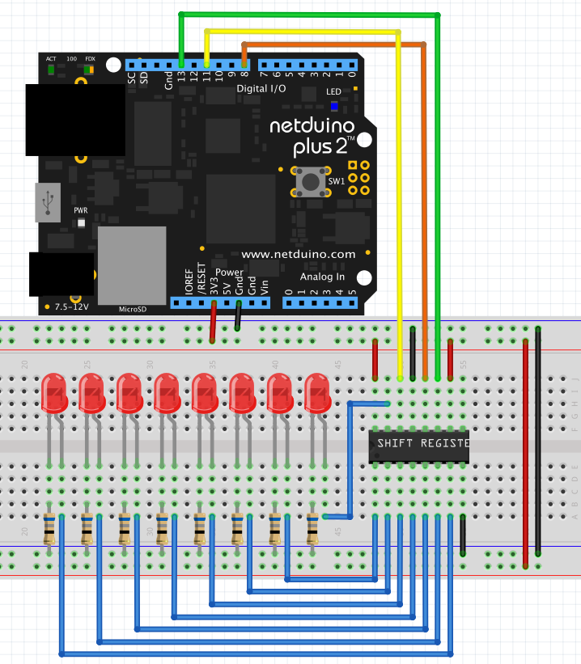

# Overview

Shift registers offer the ability to increase the number of outputs on a microcontroller by using I2C or SPI interfaces.  In the case of the 74xx595 series of shift registers, the SPI interface is used to output a series of bits that are then latched to the output pins of the chip.

The Netduino uses 3.3V to represent a logic level of 1 (high).  It is essential that the shift register used supports the use of 3.3V logic.  The HC and HCT range of shift registers are suitable for use with the Netduino family of microcontroller boards.

The 74xx595 shift registers support chaining allowing a number of chips to implement a larger shift register.  A single 74xx595 will allow the Netduino to output 8 data bits using only three lines (the SPI interface).  By adding a second shift register a an additional 8 lines can be controlled.

This class allows the Netduino to control the output pins on a 74HCT595 shift register using the SPI interface.

Note that when using this chip care should be taken to make sure that the total output load of the chip does not exceed the current and thermal dissipation properties for the specific shift register being used.

## Unified GPIO Architecture

In addition to the low-level API, the Netduino.Foundation 74HCT595 driver conforms to the [unified GPIO architecture](/API/GPIO/), which enables it to be used with other Netduino.Foundation peripherals as if the ports on the shift register chip were part of the Netduino itself. For instance, you can connect an 74HCT595 chip to a Netduino, and then drive a Relay via one of the pins on the expansion chip, just as if it were connected directly to a digital pin on the Netduino:

```csharp
// create our x74595
x74595 shiftRegister = new x74595(8, config);

// create a digital output port from that mcp
DigitalOutputPort relayPort = shiftRegister.CreateOutputPort(0, false);

// create a new relay using that digital output port
Relay relay = new Relay(relayPort);

// toggle the relay
relay.Toggle();
```

## Single Shift Register

The board below shows the Netduino connected to a shift register and 8 LEDs.  The binary value on the output pins of the shift register will be presented on the LEDs:



### Software

The application below uses a `x74595` object to cycle through the bits on the shift register and light the appropriate LED.

```csharp
using System.Threading;
using Microsoft.SPOT.Hardware;
using SecretLabs.NETMF.Hardware.Netduino;
using Netduino.Foundation.ICs.IOExpanders.x74595;
using Netduino.Foundation.Relays;
using Microsoft.SPOT;

namespace x74595_RelaySample
{
    public class Program
    {
        public static void Main()
        {
            var config = new SPI.Configuration(SPI_mod: SPI_Devices.SPI1,
                                               ChipSelect_Port: Pins.GPIO_PIN_D8,
                                               ChipSelect_ActiveState: false,
                                               ChipSelect_SetupTime: 0,
                                               ChipSelect_HoldTime: 0,
                                               Clock_IdleState: true,
                                               Clock_Edge: true,
                                               Clock_RateKHz: 10);

            var shiftRegister = new x74595(8, config);

            while (true)
            {
                shiftRegister.Clear(true);
                for (byte index = 0; index <= 7; index++)
                {
                    shiftRegister[index] = true;
                    Thread.Sleep(500);
                    shiftRegister[index] = false;
                }
            }
        }
    }
}
```

The hardware and software configuration above can be seen running on the [Netduino YouTube channel](https://youtu.be/uLxth43EwIQ).

## Chained Shift Registers

As noted above, 74xx595 shift registers can be chained together to form a larger shift register.  The circuit below shows how to connect two shift registers together to control 16 digital outputs:


The LEDs are will show a 16-bit value with the least significant bit at the far right of the sequence.

Note the small yellow wire connecting the two shift registers together.  This takes the data out of the first shift register and feeds it as an input to the second shift register.

### Software

The following code will turn on each of the 16 LEDs for 0.5 seconds and then turn it off again:

```csharp
using System.Threading;
using Microsoft.SPOT.Hardware;
using SecretLabs.NETMF.Hardware.Netduino;
using Netduino.Foundation.ICs.IOExpanders.x74595;
using Netduino.Foundation.Relays;
using Microsoft.SPOT;

namespace x74595_RelaySample
{
    public class Program
    {
        public static void Main()
        {
            var config = new SPI.Configuration(SPI_mod: SPI_Devices.SPI1,
                                               ChipSelect_Port: Pins.GPIO_PIN_D8,
                                               ChipSelect_ActiveState: false,
                                               ChipSelect_SetupTime: 0,
                                               ChipSelect_HoldTime: 0,
                                               Clock_IdleState: true,
                                               Clock_Edge: true,
                                               Clock_RateKHz: 10);

            var shiftRegister = new x74595(16, config);

            while (true)
            {
                shiftRegister.Clear(true);
                for (byte index = 0; index < 16; index++)
                {
                    shiftRegister[index] = true;
                    Thread.Sleep(500);
                    shiftRegister[index] = false;
                }
            }
        }
    }
```

## API

### Constructors

#### `x74595(int pins, SPI.Configuration config)`

Create a new `x74595` object using the parameters in the `SPI.Configuration` object.  The `SPI.Configuration` object in the sample application above is correct for a 74xx595.

The number of `pins` should be a multiple of 8 as there are 8 pins on each 74xx595 shift register.

### Methods

#### `bool this[int pin]`

The index operator is overloaded to allow simple access to each of the pins in the shift register as follows:

```csharp
shiftRegister[index] = true;
```

#### `public DigitalOutputPort CreateOutputPort(byte pin, bool initialState)`

Creates a new `DigitalOutputPort` (which implements [`IDigitalOutputPort`](/API/GPIO/IDigitalOutputPort/)) using the specified pin and initial state.

This method allows you to use an output pin on the 74HC595 as if it were a digital output pin on the Netduino, via the [unified GPIO architecture](/API/GPIO/).

#### `public void WriteToPort(int pin, bool value)`

Sets a particular pin's value, either high/`3.3V` (`true`), or low/`0V` (`false`). This method automatically calls `LatchData()` to send the data to the SPI interface.

#### `public void Clear(bool latch = false)`

Clear all of the bits in the shift register.  The optional `latch` parameter can be used to force the bits onto the output from the shift register.

#### `protected void LatchData()`

Latch the data onto the shift register outputs.

#### `protected IsValidPin(byte pin)`

Chec to see if the specified `pin` number is valid. The `pin` number is zero based and so it should be less than the number of pins used to construct the instance of the `x74595` class.